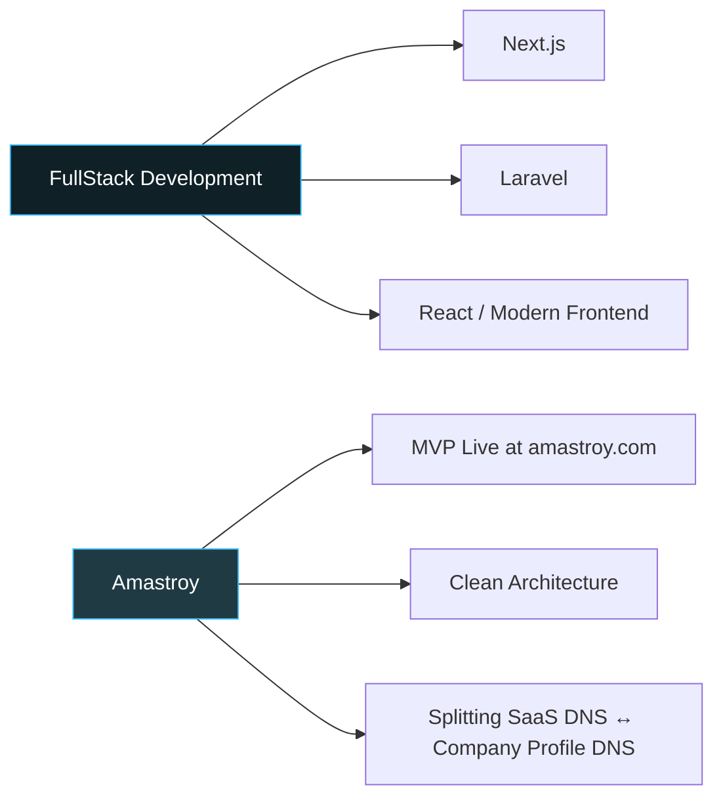

<div align="center">


<a href="https://amastroy.com">
  
</a>

<br/><br/>


</div>

<br/>

## 💫 About Me

I'm a **Software Engineering student** in my second year, focused on building scalable, efficient digital products. My journey started at **Zone01**, where I learned the fundamentals of Bash and Go — and more importantly, that a programming language is a tool, not an identity.

```yaml
whoami:
  name: Mohamed Ali Amara
  role: Software Engineering Student
  currently_building: Amastroy — a job offers marketplace SaaS
  currently_learning: FullStack architecture (Next.js / Laravel / React)
  philosophy: "It ain't simple, but it's worth it."
```

<br/>

## 🏆 Achievements & Milestones

<table>
<tr>
<td width="50%" valign="top">

### 🥇 1st Place — Meet the Lead
**7th Edition, 2025**
Placed first in a competitive team-based challenge.

</td>
<td width="50%" valign="top">

### 🎯 Finalist — Hackchrono
**1st Edition**
A pivotal experience — learned to analyze failure and iterate toward success.

</td>
</tr>
<tr>
<td width="50%" valign="top">

### 🐳 Collaborative Lead — Dockerized Workflows
Streamlined development across the club's portfolio projects using Docker.

</td>
<td width="50%" valign="top">

### 🌱 Founder — Amastroy
Designed and shipped an MVP job-market platform, live at [amastroy.com](https://amastroy.com).

</td>
</tr>
</table>

<br/>

## 🛠️ Current Focus

<div align="center">



</div>

> Amastroy still needs refinement — the plan is to move to a graphql instance for calling job markets, and i need to implement caching for custom private tenders in our site.
> As well for a RAG Model so the Ai can give out best job offers for the user's expertise.
> yeah i need a lot.

<br/>

## 💻 Tech Stack

<div align="center">

**Languages**


**Frameworks & Libraries**


**Tools & Databases**


**Thrived To Learn**


</div>

<br/>

## 📊 Activity & Stats

<div align="center">


</div>

> 📌 Not chasing streaks — chasing consistent impact and real problems solved.

<br/>


## 🤝 Special Thanks

A big part of my technical mindset comes from the **Zone01 Association**. To my friends from the Zone01 Piscine — **Abd Noor, Ahmed, Hamza, Mimone, Laarbi, Reda, and Youssef** — thank you for proving that programming is about deep thinking and shared struggle.

> *"It ain't simple, but it's worth it."*

<br/>

## 🌐 Connect With Me

<div align="center">

[](https://discord.gg/alilacrim_04808)
[](https://linkedin.com/in/Ali)
[](mailto:mohamedali.amara.24@ump.ac.ma)
[](https://amastroy.com)

</div>


